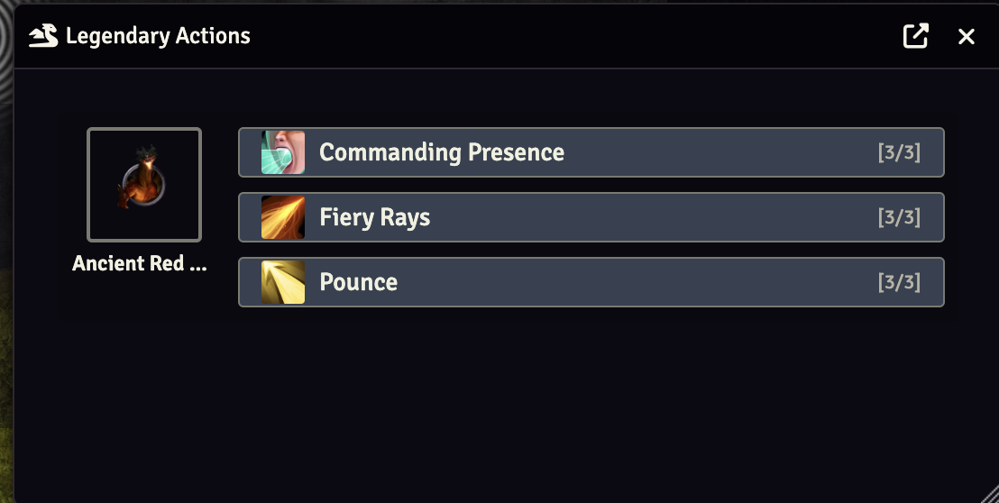

[](https://github.com/jesshmusic/dormanlakely-legendary-actions/releases/latest)
[](https://forge-vtt.com/bazaar#package=dormanlakely-legendary-actions)

# Dorman Lakely's Legendary Actions

A FoundryVTT module for **D&D 5e** that automates legendary action management during combat.

When a combatant's turn ends, the GM is automatically prompted with a dialog showing every creature in the encounter that has legendary actions remaining — so no legendary action opportunities get missed mid-fight.

## How It Works

1. When a creature with legendary actions is added to the combat tracker, the module flags it automatically.
2. At the end of each combatant's turn, a dialog appears listing all other creatures that still have legendary actions available.
3. The dialog shows each legendary action with its remaining uses (e.g. `[3/3]`).
4. Clicking an action uses it — the legendary action counter decrements on the actor sheet automatically.
5. Dead creatures (0 HP) and creatures with no remaining legendary actions are filtered out.

Legendary action recharge is handled natively by the dnd5e system at the start of each creature's turn.

## Legendary Action Dialog



## Requirements

- FoundryVTT v13+
- D&D 5e system v4.0+

## Settings

Found under **Settings → Module Settings → Dorman Lakely's Legendary Actions**:

| Setting | Default | Description |
|---|---|---|
| Legendary Action Prompt | Enabled | Show the legendary action dialog at the end of each combatant's turn |
| Extended debug output | Disabled | Log additional debugging information to the browser console |

## Development

```bash
npm install       # Install dependencies
npm run build     # Compile TypeScript → dist/main.js
npm run dev       # Watch mode (rebuilds on file change)
npm test          # Run unit tests
npm test -- --coverage  # Run tests with coverage report
```

## Credits

Originally derived from [Simbul's Creature Aide](https://github.com/vtt-lair/simbuls-creature-aide), stripped down to legendary actions only and rewritten in TypeScript for Foundry v13 / dnd5e v4.
